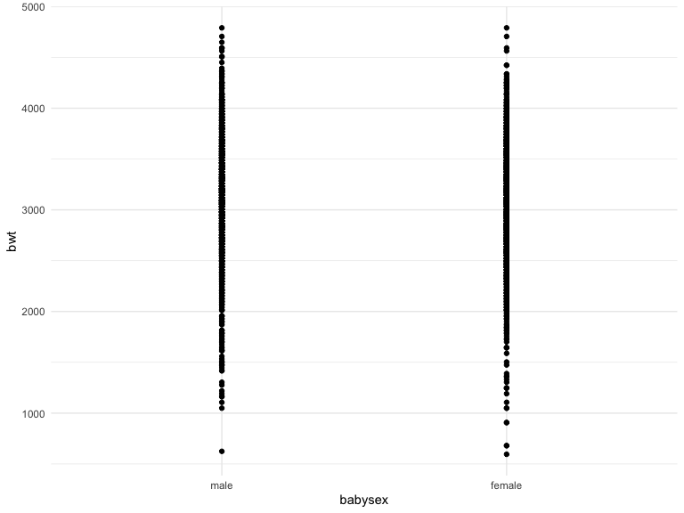
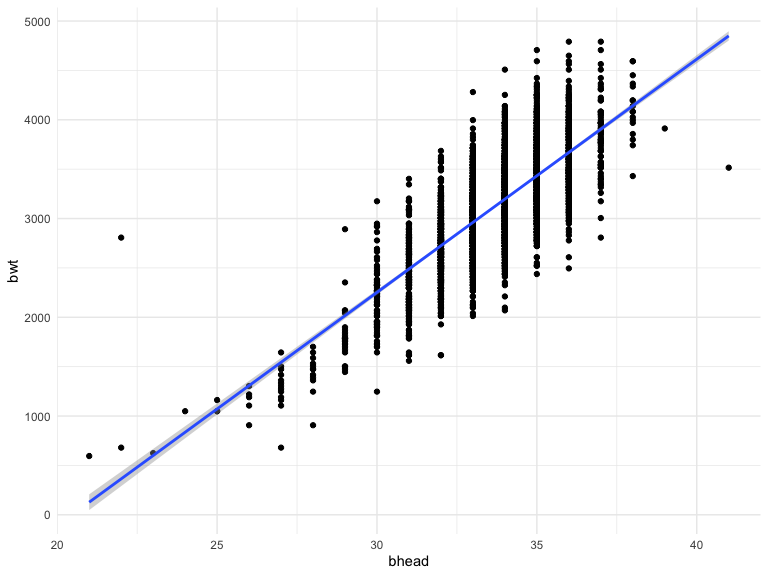
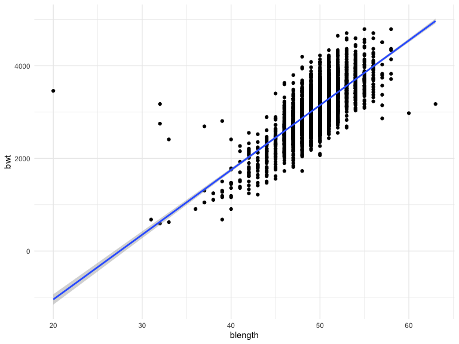
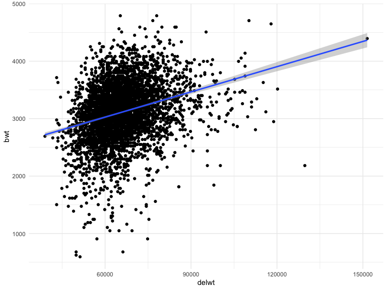

p8105\_hw6\_at3346
================
Ashley Tseng
11/27/2019

## Problem 1

``` r
birthweight_data = 
  read_csv("./data/birthweight.csv", col_names = TRUE) %>%
  janitor::clean_names() %>% 
  mutate(
  babysex = as.factor(babysex),
  babysex = recode(
    babysex, 
    "1" = "male", 
    "2" = "female"),
  frace = as.factor(frace),
  frace = recode(
    frace, 
    "1" = "White", 
    "2" = "Black", 
    "3" = "Asian", 
    "4" = "Puerto Rican", 
    "8" = "Other", 
    "9" = "Unknown"), 
  malform = as.factor(malform),
  malform = recode(
    malform,
    "0" = "absent", 
    "1" = "present"),
  mrace = as.factor(mrace),
  mrace = recode(
    frace, 
    "1" = "White", 
    "2" = "Black", 
    "3" = "Asian", 
    "4" = "Puerto Rican", 
    "8" = "Other", 
    "9" = "Unknown"),
  delwt = round(conv_unit(delwt, "lbs", "g"), digits = 0),
  ppwt = round(conv_unit(ppwt, "lbs", "g"), digits = 0),
  wtgain = round(conv_unit(wtgain, "lbs", "g"), digits = 0),
  mheight = round(conv_unit(mheight, "inch", "cm"), digits = 0))
```

    ## Parsed with column specification:
    ## cols(
    ##   .default = col_double()
    ## )

    ## See spec(...) for full column specifications.

The variables I hypothesize that underly baby’s birthweight include:
babysex, bhead, blength, delwt, gaweeks, momage, pnumlbw, and pnumsga. I
will plot each of these hypothesized variables against baby’s
birthweight.

``` r
birthweight_data %>% 
  ggplot(aes(x = babysex, y = bwt)) + 
  geom_point() + 
  geom_smooth(method = 'lm')
```



``` r
birthweight_data %>% 
  ggplot(aes(x = bhead, y = bwt)) + 
  geom_point() + 
  geom_smooth(method = 'lm')
```



``` r
birthweight_data %>% 
  ggplot(aes(x = blength, y = bwt)) + 
  geom_point() + 
  geom_smooth(method = 'lm')
```



``` r
birthweight_data %>% 
  ggplot(aes(x = gaweeks, y = bwt)) + 
  geom_point() + 
  geom_smooth(method = 'lm')
```



Based on my exploratory analysis of visually inspecting the plots, I
will fit a regression model with baby’s sex, baby’s head circumference
at birth (cm), baby’s length at birth (cm), and gestational age in
weeks:

``` r
fit = lm(bwt ~ babysex + bhead + blength + gaweeks, data = birthweight_data)

fit %>% 
  broom::tidy() %>% 
  select(term, estimate, p.value) %>% 
  knitr::kable(digits = 4)
```

| term          |    estimate | p.value |
| :------------ | ----------: | ------: |
| (Intercept)   | \-6264.1543 |   0e+00 |
| babysexfemale |     33.4196 |   2e-04 |
| bhead         |    140.8672 |   0e+00 |
| blength       |     81.7556 |   0e+00 |
| gaweeks       |     14.0672 |   0e+00 |

## Problem 2

``` r
weather_df = 
  rnoaa::meteo_pull_monitors(
    c("USW00094728"),
    var = c("PRCP", "TMIN", "TMAX"), 
    date_min = "2017-01-01",
    date_max = "2017-12-31") %>%
  mutate(
    name = recode(id, USW00094728 = "CentralPark_NY"),
    tmin = tmin / 10,
    tmax = tmax / 10) %>%
  select(name, id, everything())
```

    ## Registered S3 method overwritten by 'crul':
    ##   method                 from
    ##   as.character.form_file httr

    ## Registered S3 method overwritten by 'hoardr':
    ##   method           from
    ##   print.cache_info httr

    ## file path:          /Users/ashleytseng/Library/Caches/rnoaa/ghcnd/USW00094728.dly

    ## file last updated:  2019-09-26 10:24:58

    ## file min/max dates: 1869-01-01 / 2019-09-30
