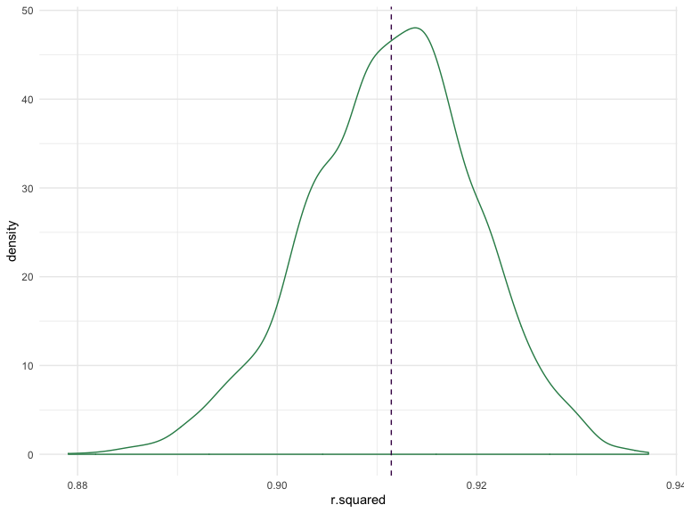
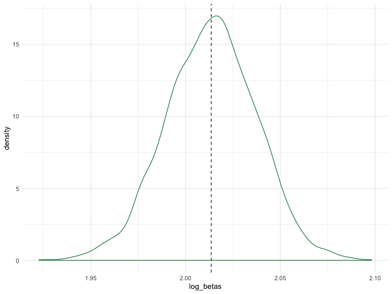

p8105\_hw6\_at3346
================
Ashley Tseng
11/27/2019

## Problem 1

First I will load and tidy the birthweight dataset. I will standardize
all variables to metric units by converting using the `measurements`
package (note: I decided to utilize an existing package to convert my
units because I wanted to make good use of the hard work that went into
making that package\! Please don’t take points off.).

``` r
birthweight_data = 
  read_csv("./data/birthweight.csv", col_names = TRUE) %>%
  janitor::clean_names() %>% 
  mutate(
  babysex = as.factor(babysex),
  babysex = recode(
    babysex, 
    "1" = "male", 
    "2" = "female"),
  frace = as.factor(frace),
  frace = recode(
    frace, 
    "1" = "White", 
    "2" = "Black", 
    "3" = "Asian", 
    "4" = "Puerto Rican", 
    "8" = "Other", 
    "9" = "Unknown"), 
  malform = as.factor(malform),
  malform = recode(
    malform,
    "0" = "absent", 
    "1" = "present"),
  mrace = as.factor(mrace),
  mrace = recode(
    frace, 
    "1" = "White", 
    "2" = "Black", 
    "3" = "Asian", 
    "4" = "Puerto Rican", 
    "8" = "Other", 
    "9" = "Unknown"),
  delwt = round(conv_unit(delwt, "lbs", "g"), digits = 0),
  ppwt = round(conv_unit(ppwt, "lbs", "g"), digits = 0),
  wtgain = round(conv_unit(wtgain, "lbs", "g"), digits = 0),
  mheight = round(conv_unit(mheight, "inch", "cm"), digits = 0))
```

    ## Parsed with column specification:
    ## cols(
    ##   .default = col_double()
    ## )

    ## See spec(...) for full column specifications.

The variables I hypothesize that underlie baby’s birthweight include:
babysex, bhead, blength, delwt, gaweeks, momage, pnumlbw, pnumsga, and
smoken. First, I will run bivariate analyses for each hypothesized
variable to check for statistical significance of the independent
association with the outcome of baby’s birthweight. Then, I will plot
each of these hypothesized variables against baby’s birthweight to check
for linear association visually.

``` r
uni_babysex = lm(bwt ~ babysex, data = birthweight_data)

uni_babysex %>% 
  broom::tidy() %>% 
  select(term, estimate, p.value) %>% 
  rename(
    "Term" = "term",
    "Estimate" = "estimate",
    "p-value" = "p.value") %>% 
  knitr::kable(digits = 5)
```

| Term          |   Estimate | p-value |
| :------------ | ---------: | ------: |
| (Intercept)   | 3157.58296 |       0 |
| babysexfemale | \-88.77046 |       0 |

``` r
birthweight_data %>% 
  ggplot(aes(x = babysex, y = bwt)) + 
  geom_point() + 
  geom_smooth(method = 'lm')
```


``` r
uni_bhead = lm(bwt ~ bhead, data = birthweight_data)

uni_bhead %>% 
  broom::tidy() %>% 
  select(term, estimate, p.value) %>% 
  rename(
    "Term" = "term",
    "Estimate" = "estimate",
    "p-value" = "p.value") %>% 
  knitr::kable(digits = 5)
```

| Term        |   Estimate | p-value |
| :---------- | ---------: | ------: |
| (Intercept) | \-4830.866 |       0 |
| bhead       |    236.109 |       0 |

``` r
birthweight_data %>% 
  ggplot(aes(x = bhead, y = bwt)) + 
  geom_point() + 
  geom_smooth(method = 'lm')
```


``` r
uni_blength = lm(bwt ~ blength, data = birthweight_data)

uni_blength %>% 
  broom::tidy() %>% 
  select(term, estimate, p.value) %>% 
  rename(
    "Term" = "term",
    "Estimate" = "estimate",
    "p-value" = "p.value") %>% 
  knitr::kable(digits = 5)
```

| Term        |    Estimate | p-value |
| :---------- | ----------: | ------: |
| (Intercept) | \-3841.2667 |       0 |
| blength     |    139.8109 |       0 |

``` r
birthweight_data %>% 
  ggplot(aes(x = blength, y = bwt)) + 
  geom_point() + 
  geom_smooth(method = 'lm')
```


``` r
uni_delwt = lm(bwt ~ delwt, data = birthweight_data)

uni_delwt %>% 
  broom::tidy() %>% 
  select(term, estimate, p.value) %>% 
  rename(
    "Term" = "term",
    "Estimate" = "estimate",
    "p-value" = "p.value") %>% 
  knitr::kable(digits = 5)
```

| Term        |   Estimate | p-value |
| :---------- | ---------: | ------: |
| (Intercept) | 2147.91308 |       0 |
| delwt       |    0.01464 |       0 |

``` r
birthweight_data %>% 
  ggplot(aes(x = delwt, y = bwt)) + 
  geom_point() + 
  geom_smooth(method = 'lm')
```


``` r
uni_gaweeks = lm(bwt ~ gaweeks, data = birthweight_data)

uni_gaweeks %>% 
  broom::tidy() %>% 
  select(term, estimate, p.value) %>% 
  rename(
    "Term" = "term",
    "Estimate" = "estimate",
    "p-value" = "p.value") %>% 
  knitr::kable(digits = 5)
```

| Term        |  Estimate | p-value |
| :---------- | --------: | ------: |
| (Intercept) | 476.00261 |       0 |
| gaweeks     |  66.91991 |       0 |

``` r
birthweight_data %>% 
  ggplot(aes(x = gaweeks, y = bwt)) + 
  geom_point() + 
  geom_smooth(method = 'lm')
```


``` r
uni_momage = lm(bwt ~ momage, data = birthweight_data)

uni_momage %>% 
  broom::tidy() %>% 
  select(term, estimate, p.value) %>% 
  rename(
    "Term" = "term",
    "Estimate" = "estimate",
    "p-value" = "p.value") %>% 
  knitr::kable(digits = 5)
```

| Term        |   Estimate | p-value |
| :---------- | ---------: | ------: |
| (Intercept) | 2750.40746 |       0 |
| momage      |   17.93159 |       0 |

``` r
birthweight_data %>% 
  ggplot(aes(x = momage, y = bwt)) + 
  geom_point() + 
  geom_smooth(method = 'lm')
```


``` r
uni_pnumlbw = lm(bwt ~ pnumlbw, data = birthweight_data)

uni_pnumlbw %>% 
  broom::tidy() %>% 
  select(term, estimate, p.value) %>% 
  rename(
    "Term" = "term",
    "Estimate" = "estimate",
    "p-value" = "p.value") %>% 
  knitr::kable(digits = 5)
```

| Term        | Estimate | p-value |
| :---------- | -------: | ------: |
| (Intercept) | 3114.404 |       0 |

``` r
birthweight_data %>% 
  ggplot(aes(x = pnumlbw, y = bwt)) + 
  geom_point() + 
  geom_smooth(method = 'lm')
```


``` r
uni_pnumsga = lm(bwt ~ pnumsga, data = birthweight_data)

uni_pnumsga %>% 
  broom::tidy() %>% 
  select(term, estimate, p.value) %>% 
  rename(
    "Term" = "term",
    "Estimate" = "estimate",
    "p-value" = "p.value") %>% 
  knitr::kable(digits = 5)
```

| Term        | Estimate | p-value |
| :---------- | -------: | ------: |
| (Intercept) | 3114.404 |       0 |

``` r
birthweight_data %>% 
  ggplot(aes(x = pnumsga, y = bwt)) + 
  geom_point() + 
  geom_smooth(method = 'lm')
```


``` r
uni_smoken = lm(bwt ~ smoken, data = birthweight_data)

uni_smoken %>% 
  broom::tidy() %>% 
  select(term, estimate, p.value) %>% 
  rename(
    "Term" = "term",
    "Estimate" = "estimate",
    "p-value" = "p.value") %>% 
  knitr::kable(digits = 5)
```

| Term        |   Estimate | p-value |
| :---------- | ---------: | ------: |
| (Intercept) | 3136.07856 |       0 |
| smoken      |  \-5.22887 |       0 |

``` r
birthweight_data %>% 
  ggplot(aes(x = smoken, y = bwt)) + 
  geom_point() + 
  geom_smooth(method = 'lm')
```


All variables were found to be independently significantly associated
with baby’s birthweight. Based on visually inspecting the plots,
`delwt`, `momage`, `pnumlbw`, `pnumsga`, and `smoken` do not seem to be
linearly associated with baby’s birthweight. Hence, I will fit an
original regression model for baby’s birthweight with baby’s sex, baby’s
head circumference at birth (cm), baby’s length at birth (cm), and
gestational age in
weeks.

``` r
fit_og = lm(bwt ~ babysex + bhead + blength + gaweeks, data = birthweight_data)

fit_og %>% 
  broom::tidy() %>% 
  select(term, estimate, p.value) %>% 
  rename(
    "Term" = "term",
    "Estimate" = "estimate",
    "p-value" = "p.value") %>% 
  knitr::kable(digits = 3)
```

| Term          |   Estimate | p-value |
| :------------ | ---------: | ------: |
| (Intercept)   | \-6264.154 |       0 |
| babysexfemale |     33.420 |       0 |
| bhead         |    140.867 |       0 |
| blength       |     81.756 |       0 |
| gaweeks       |     14.067 |       0 |

Plot of model residuals against fitted values:

``` r
birthweight_data %>% 
  modelr::add_residuals(fit_og) %>% 
  modelr::add_predictions(fit_og) %>% 
  ggplot(aes(x = pred, y = resid)) + 
  geom_point()
```


Fit a model with length at birth and gestational age (main effects
only):

``` r
fit_maineff = lm(bwt ~ blength + gaweeks, data = birthweight_data)

fit_maineff %>% 
  broom::tidy() %>% 
  select(term, estimate, p.value) %>% 
  rename(
    "Term" = "term",
    "Estimate" = "estimate",
    "p-value" = "p.value") %>% 
  knitr::kable(digits = 3)
```

| Term        |   Estimate | p-value |
| :---------- | ---------: | ------: |
| (Intercept) | \-4347.667 |       0 |
| blength     |    128.556 |       0 |
| gaweeks     |     27.047 |       0 |

Fit a model with head circumference, length, sex, and all interactions
(including the three-way interaction) between
these:

``` r
fit_int = lm(bwt ~ bhead + blength + babysex + bhead * blength + bhead * babysex + blength * babysex +  bhead * blength * babysex, data = birthweight_data)

fit_int %>%
  broom::tidy() %>% 
  select(term, estimate, p.value) %>% 
  rename(
    "Term" = "term",
    "Estimate" = "estimate",
    "p-value" = "p.value") %>% 
  knitr::kable(digits = 3)
```

| Term                        |   Estimate | p-value |
| :-------------------------- | ---------: | ------: |
| (Intercept)                 | \-7176.817 |   0.000 |
| bhead                       |    181.796 |   0.000 |
| blength                     |    102.127 |   0.000 |
| babysexfemale               |   6374.868 |   0.000 |
| bhead:blength               |    \-0.554 |   0.478 |
| bhead:babysexfemale         |  \-198.393 |   0.000 |
| blength:babysexfemale       |  \-123.773 |   0.000 |
| bhead:blength:babysexfemale |      3.878 |   0.000 |

Fit models and obtain RMSE to assess prediction accuracy for different
models:

``` r
cv_df = 
  crossv_mc(birthweight_data, 100) 

cv_df %>% pull(train) %>% .[[1]] %>% as_tibble
```

    ## # A tibble: 3,473 x 20
    ##    babysex bhead blength   bwt delwt fincome frace gaweeks malform menarche
    ##    <fct>   <dbl>   <dbl> <dbl> <dbl>   <dbl> <fct>   <dbl> <fct>      <dbl>
    ##  1 female     36      50  3345 67132      85 White    39.9 absent        12
    ##  2 male       34      52  3062 71214      55 White    40   absent        14
    ##  3 female     34      52  3374 70760       5 White    41.6 absent        13
    ##  4 male       33      52  3374 58513      55 White    40.7 absent        12
    ##  5 female     33      49  2778 63503       5 White    37.4 absent        12
    ##  6 male       36      52  3515 66224      85 White    40.3 absent        11
    ##  7 female     35      51  3317 58967      55 White    43.4 absent        13
    ##  8 male       35      51  3459 66224      55 White    39.4 absent        12
    ##  9 female     35      48  3175 71668      75 White    39.7 absent        13
    ## 10 male       36      53  3629 66678      75 White    41.3 absent        11
    ## # … with 3,463 more rows, and 10 more variables: mheight <dbl>,
    ## #   momage <dbl>, mrace <fct>, parity <dbl>, pnumlbw <dbl>, pnumsga <dbl>,
    ## #   ppbmi <dbl>, ppwt <dbl>, smoken <dbl>, wtgain <dbl>

``` r
cv_df %>% pull(test) %>% .[[1]] %>% as_tibble
```

    ## # A tibble: 869 x 20
    ##    babysex bhead blength   bwt delwt fincome frace gaweeks malform menarche
    ##    <fct>   <dbl>   <dbl> <dbl> <dbl>   <dbl> <fct>   <dbl> <fct>      <dbl>
    ##  1 female     34      51  3629 80286      35 White    39.9 absent        13
    ##  2 male       34      48  3062 70760      65 Black    25.9 absent        14
    ##  3 female     33      46  2523 57153      96 Black    40.3 absent        14
    ##  4 male       33      50  3459 76657      75 Black    40.7 absent        12
    ##  5 female     36      52  3629 69853      65 White    40.3 absent        11
    ##  6 female     35      50  3175 63503      85 Black    40.6 absent        14
    ##  7 female     36      51  2977 61235      45 White    41.7 absent        13
    ##  8 female     35      52  3289 61235      55 White    40.6 absent        13
    ##  9 female     34      49  3118 73028      45 Black    38.9 absent        10
    ## 10 female     33      54  3062 60781      65 White    40.4 absent        12
    ## # … with 859 more rows, and 10 more variables: mheight <dbl>,
    ## #   momage <dbl>, mrace <fct>, parity <dbl>, pnumlbw <dbl>, pnumsga <dbl>,
    ## #   ppbmi <dbl>, ppwt <dbl>, smoken <dbl>, wtgain <dbl>

``` r
cv_df =
  cv_df %>% 
  mutate(
    train = map(train, as_tibble),
    test = map(test, as_tibble))

cv_df = 
  cv_df %>% 
  mutate(og_mod  = map(train, ~lm(bwt ~ babysex + bhead + blength + gaweeks, data = .x)),
         maineff_mod  = map(train, ~lm(bwt ~ blength + gaweeks, data = .x)),
         int_mod  = map(train, ~lm(bwt ~ bhead + blength + babysex + bhead * blength + bhead * babysex + blength * babysex + bhead * blength * babysex, data = .x))) %>% 
  mutate(rmse_og = map2_dbl(og_mod, test, ~rmse(model = .x, data = .y)),
         rmse_maineff = map2_dbl(maineff_mod, test, ~rmse(model = .x, data = .y)),
         rmse_int = map2_dbl(int_mod, test, ~rmse(model = .x, data = .y)))

cv_df %>% 
  select(starts_with("rmse")) %>% 
  pivot_longer(
    everything(),
    names_to = "model", 
    values_to = "rmse",
    names_prefix = "rmse_") %>% 
  mutate(model = fct_inorder(model)) %>% 
  ggplot(aes(x = model, y = rmse)) + 
  geom_violin()
```


## Problem 2

``` r
weather_df = 
  rnoaa::meteo_pull_monitors(
    c("USW00094728"),
    var = c("PRCP", "TMIN", "TMAX"), 
    date_min = "2017-01-01",
    date_max = "2017-12-31") %>%
  mutate(
    name = recode(id, USW00094728 = "CentralPark_NY"),
    tmin = tmin / 10,
    tmax = tmax / 10) %>%
  select(name, id, everything())
```

    ## Registered S3 method overwritten by 'crul':
    ##   method                 from
    ##   as.character.form_file httr

    ## Registered S3 method overwritten by 'hoardr':
    ##   method           from
    ##   print.cache_info httr

    ## file path:          /Users/ashleytseng/Library/Caches/rnoaa/ghcnd/USW00094728.dly

    ## file last updated:  2019-09-26 10:24:58

    ## file min/max dates: 1869-01-01 / 2019-09-30

Writing a bootstrap function to draw repeated samples with replacement:

``` r
set.seed(8)

boot_func = function(weather_df) {
  sample_frac(weather_df, replace = TRUE)
}

boot_samp = 
  tibble(
    strap_number = 1:5000,
    strap_sample = rerun(5000, boot_func(weather_df))) 
```

Producing estimates and plotting distribution of r^2 values:

``` r
bootstrap_rsquared = 
  boot_samp %>% 
  mutate(
    models = map(strap_sample, ~lm(tmax ~ tmin, data = .x) ),
    results = map(models, broom::glance)) %>% 
  select(-strap_sample, -models) %>% 
  unnest(cols = c(results)) %>% 
  select(strap_number, r.squared) 

bootstrap_rsquared %>% 
  ggplot(aes(x = r.squared)) + 
  geom_density(color = "seagreen") +
  geom_vline(aes(xintercept = mean(r.squared), color = "blue"), linetype = "dashed") +
  theme(legend.position = "none")
```



The distribution of the r^2 values is left-skewed. The distribution has
a slightly heavy tail extending to low values and a bit of a “shoulder”,
features that may be related to the frequency with which large outliers
are included in the bootstrap sample.

The 95% confidence interval of r^2 based on the 2.5% and 97.5% quantiles
is (0.89, 0.93).

Producing estimates and plotting distribution of log(β0\*β1) values:

``` r
bootstrap_logbetas = 
  boot_samp %>% 
  mutate(
    models = map(strap_sample, ~lm(tmax ~ tmin, data = .x)),
    results = map(models, broom::tidy)) %>% 
  unnest(cols = c(results)) %>% 
  select(strap_number, term, estimate) %>% 
  pivot_wider(
    names_from = term,
    values_from = estimate) %>% 
  rename(
    "B0" = "(Intercept)",
    "B1" = "tmin") %>% 
  mutate(log_betas = log(B0*B1)) 

bootstrap_logbetas %>% 
  ggplot(aes(x = log_betas)) + 
  geom_density(color = "seagreen") +
  geom_vline(aes(xintercept = mean(log_betas), color = "blue"), linetype = "dashed") +
  theme(legend.position = "none")
```



The distribution of the log(β0\*β1) is approximately normal. This is
likely due to the log-transformation of the product of β0 and β1 which
is often used to transform skewed data to approximately conform to
normality.

The 95% confidence interval of log(β0\*β1) based on the 2.5% and 97.5%
quantiles is (1.97, 2.06).
