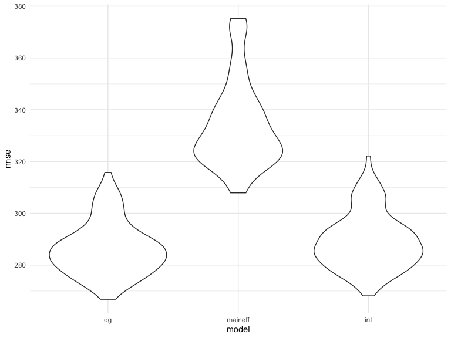

p8105\_hw6\_at3346
================
Ashley Tseng
11/27/2019

## Problem 1

``` r
birthweight_data = 
  read_csv("./data/birthweight.csv", col_names = TRUE) %>%
  janitor::clean_names() %>% 
  mutate(
  babysex = as.factor(babysex),
  babysex = recode(
    babysex, 
    "1" = "male", 
    "2" = "female"),
  frace = as.factor(frace),
  frace = recode(
    frace, 
    "1" = "White", 
    "2" = "Black", 
    "3" = "Asian", 
    "4" = "Puerto Rican", 
    "8" = "Other", 
    "9" = "Unknown"), 
  malform = as.factor(malform),
  malform = recode(
    malform,
    "0" = "absent", 
    "1" = "present"),
  mrace = as.factor(mrace),
  mrace = recode(
    frace, 
    "1" = "White", 
    "2" = "Black", 
    "3" = "Asian", 
    "4" = "Puerto Rican", 
    "8" = "Other", 
    "9" = "Unknown"),
  delwt = round(conv_unit(delwt, "lbs", "g"), digits = 0),
  ppwt = round(conv_unit(ppwt, "lbs", "g"), digits = 0),
  wtgain = round(conv_unit(wtgain, "lbs", "g"), digits = 0),
  mheight = round(conv_unit(mheight, "inch", "cm"), digits = 0))
```

    ## Parsed with column specification:
    ## cols(
    ##   .default = col_double()
    ## )

    ## See spec(...) for full column specifications.

The variables I hypothesize that underly baby’s birthweight include:
babysex, bhead, blength, delwt, gaweeks, momage, pnumlbw, and pnumsga. I
will plot each of these hypothesized variables against baby’s
birthweight.

``` r
birthweight_data %>% 
  ggplot(aes(x = babysex, y = bwt)) + 
  geom_point() + 
  geom_smooth(method = 'lm')
```


``` r
birthweight_data %>% 
  ggplot(aes(x = bhead, y = bwt)) + 
  geom_point() + 
  geom_smooth(method = 'lm')
```


``` r
birthweight_data %>% 
  ggplot(aes(x = blength, y = bwt)) + 
  geom_point() + 
  geom_smooth(method = 'lm')
```


``` r
birthweight_data %>% 
  ggplot(aes(x = gaweeks, y = bwt)) + 
  geom_point() + 
  geom_smooth(method = 'lm')
```


Based on my exploratory analysis of visually inspecting the plots, I
will fit a regression model with baby’s sex, baby’s head circumference
at birth (cm), baby’s length at birth (cm), and gestational age in
weeks:

``` r
fit_og = lm(bwt ~ babysex + bhead + blength + gaweeks, data = birthweight_data)

fit_og %>% 
  broom::tidy() %>% 
  select(term, estimate, p.value) %>% 
  knitr::kable(digits = 4)
```

| term          |    estimate | p.value |
| :------------ | ----------: | ------: |
| (Intercept)   | \-6264.1543 |   0e+00 |
| babysexfemale |     33.4196 |   2e-04 |
| bhead         |    140.8672 |   0e+00 |
| blength       |     81.7556 |   0e+00 |
| gaweeks       |     14.0672 |   0e+00 |

``` r
birthweight_data %>% 
  modelr::add_residuals(fit_og) %>% 
  modelr::add_predictions(fit_og) %>% 
  ggplot(aes(x = pred, y = resid)) + 
  geom_point()
```


``` r
fit_maineff = lm(bwt ~ blength + gaweeks, data = birthweight_data)

fit_maineff %>% 
  broom::tidy() %>% 
  select(term, estimate, p.value) %>% 
  knitr::kable(digits = 4)
```

| term        |    estimate | p.value |
| :---------- | ----------: | ------: |
| (Intercept) | \-4347.6671 |       0 |
| blength     |    128.5557 |       0 |
| gaweeks     |     27.0467 |       0 |

``` r
fit_int = lm(bwt ~ bhead + blength + babysex + bhead * blength + bhead * babysex + blength * babysex +  bhead * blength * babysex, data = birthweight_data)

fit_int %>%
  broom::tidy() %>% 
  select(term, estimate, p.value) %>% 
  knitr::kable(digits = 4)
```

| term                        |    estimate | p.value |
| :-------------------------- | ----------: | ------: |
| (Intercept)                 | \-7176.8170 |  0.0000 |
| bhead                       |    181.7956 |  0.0000 |
| blength                     |    102.1269 |  0.0001 |
| babysexfemale               |   6374.8684 |  0.0001 |
| bhead:blength               |    \-0.5536 |  0.4780 |
| bhead:babysexfemale         |  \-198.3932 |  0.0001 |
| blength:babysexfemale       |  \-123.7729 |  0.0004 |
| bhead:blength:babysexfemale |      3.8781 |  0.0002 |

Fit models and obtain RMSE to assess prediction accuracy for different
models:

``` r
cv_df = 
  crossv_mc(birthweight_data, 100) 

cv_df %>% pull(train) %>% .[[1]] %>% as_tibble
```

    ## # A tibble: 3,473 x 20
    ##    babysex bhead blength   bwt delwt fincome frace gaweeks malform menarche
    ##    <fct>   <dbl>   <dbl> <dbl> <dbl>   <dbl> <fct>   <dbl> <fct>      <dbl>
    ##  1 female     34      51  3629 80286      35 White    39.9 absent        13
    ##  2 male       34      48  3062 70760      65 Black    25.9 absent        14
    ##  3 female     36      50  3345 67132      85 White    39.9 absent        12
    ##  4 male       34      52  3062 71214      55 White    40   absent        14
    ##  5 female     34      52  3374 70760       5 White    41.6 absent        13
    ##  6 male       33      52  3374 58513      55 White    40.7 absent        12
    ##  7 female     33      49  2778 63503       5 White    37.4 absent        12
    ##  8 male       33      50  3459 76657      75 Black    40.7 absent        12
    ##  9 male       35      51  3459 66224      55 White    39.4 absent        12
    ## 10 female     35      48  3175 71668      75 White    39.7 absent        13
    ## # … with 3,463 more rows, and 10 more variables: mheight <dbl>,
    ## #   momage <dbl>, mrace <fct>, parity <dbl>, pnumlbw <dbl>, pnumsga <dbl>,
    ## #   ppbmi <dbl>, ppwt <dbl>, smoken <dbl>, wtgain <dbl>

``` r
cv_df %>% pull(test) %>% .[[1]] %>% as_tibble
```

    ## # A tibble: 869 x 20
    ##    babysex bhead blength   bwt delwt fincome frace gaweeks malform menarche
    ##    <fct>   <dbl>   <dbl> <dbl> <dbl>   <dbl> <fct>   <dbl> <fct>      <dbl>
    ##  1 female     33      46  2523 57153      96 Black    40.3 absent        14
    ##  2 male       36      52  3515 66224      85 White    40.3 absent        11
    ##  3 female     35      51  3317 58967      55 White    43.4 absent        13
    ##  4 female     35      57  3374 66678      45 White    39.6 absent        12
    ##  5 female     36      51  2977 61235      45 White    41.7 absent        13
    ##  6 male       35      51  3345 65771      75 White    41.3 absent        12
    ##  7 female     34      52  3629 50802      25 White    38   absent        10
    ##  8 male       36      54  3402 73028      95 White    40.1 absent        11
    ##  9 female     34      49  3317 64410      35 White    40.4 absent        12
    ## 10 female     34      49  3033 58060      25 White    41.1 absent        12
    ## # … with 859 more rows, and 10 more variables: mheight <dbl>,
    ## #   momage <dbl>, mrace <fct>, parity <dbl>, pnumlbw <dbl>, pnumsga <dbl>,
    ## #   ppbmi <dbl>, ppwt <dbl>, smoken <dbl>, wtgain <dbl>

``` r
cv_df =
  cv_df %>% 
  mutate(
    train = map(train, as_tibble),
    test = map(test, as_tibble))

cv_df = 
  cv_df %>% 
  mutate(og_mod  = map(train, ~lm(bwt ~ babysex + bhead + blength + gaweeks, data = .x)),
         maineff_mod  = map(train, ~lm(bwt ~ blength + gaweeks, data = .x)),
         int_mod  = map(train, ~lm(bwt ~ bhead + blength + babysex + bhead * blength + bhead * babysex + blength * babysex + bhead * blength * babysex, data = .x))) %>% 
  mutate(rmse_og = map2_dbl(og_mod, test, ~rmse(model = .x, data = .y)),
         rmse_maineff = map2_dbl(maineff_mod, test, ~rmse(model = .x, data = .y)),
         rmse_int = map2_dbl(int_mod, test, ~rmse(model = .x, data = .y)))

cv_df %>% 
  select(starts_with("rmse")) %>% 
  pivot_longer(
    everything(),
    names_to = "model", 
    values_to = "rmse",
    names_prefix = "rmse_") %>% 
  mutate(model = fct_inorder(model)) %>% 
  ggplot(aes(x = model, y = rmse)) + 
  geom_violin()
```



## Problem 2

``` r
weather_df = 
  rnoaa::meteo_pull_monitors(
    c("USW00094728"),
    var = c("PRCP", "TMIN", "TMAX"), 
    date_min = "2017-01-01",
    date_max = "2017-12-31") %>%
  mutate(
    name = recode(id, USW00094728 = "CentralPark_NY"),
    tmin = tmin / 10,
    tmax = tmax / 10) %>%
  select(name, id, everything())
```

    ## Registered S3 method overwritten by 'crul':
    ##   method                 from
    ##   as.character.form_file httr

    ## Registered S3 method overwritten by 'hoardr':
    ##   method           from
    ##   print.cache_info httr

    ## file path:          /Users/ashleytseng/Library/Caches/rnoaa/ghcnd/USW00094728.dly

    ## file last updated:  2019-09-26 10:24:58

    ## file min/max dates: 1869-01-01 / 2019-09-30

``` r
set.seed(8)

boot_func = function(weather_df) {
  sample_frac(weather_df, replace = TRUE)
}

boot_samp = 
  tibble(
    strap_number = 1:5000,
    strap_sample = rerun(5000, boot_func(weather_df))
  ) 
```

``` r
bootstrap_rsquared = 
  boot_samp %>% 
  mutate(
    models = map(strap_sample, ~lm(tmax ~ tmin, data = .x) ),
    results = map(models, broom::glance)) %>% 
  select(-strap_sample, -models) %>% 
  unnest(cols = c(results)) %>% 
  select(strap_number, r.squared) %>% 
  ggplot(aes(x = r.squared)) + 
  geom_density(color = "seagreen")

bootstrap_rsquared
```


``` r
bootstrap_logbetas = 
  boot_samp %>% 
  mutate(
    models = map(strap_sample, ~lm(tmax ~ tmin, data = .x)),
    results = map(models, broom::tidy)) %>% 
  unnest(cols = c(results)) %>% 
  select(strap_number, term, estimate) %>% 
  pivot_wider(
    names_from = term,
    values_from = estimate) %>% 
  rename(
    "B0" = "(Intercept)",
    "B1" = "tmin") %>% 
  mutate(log_betas = log(B0*B1)) %>% 
  ggplot(aes(x = log_betas)) + 
  geom_density(color = "seagreen")

bootstrap_logbetas
```


